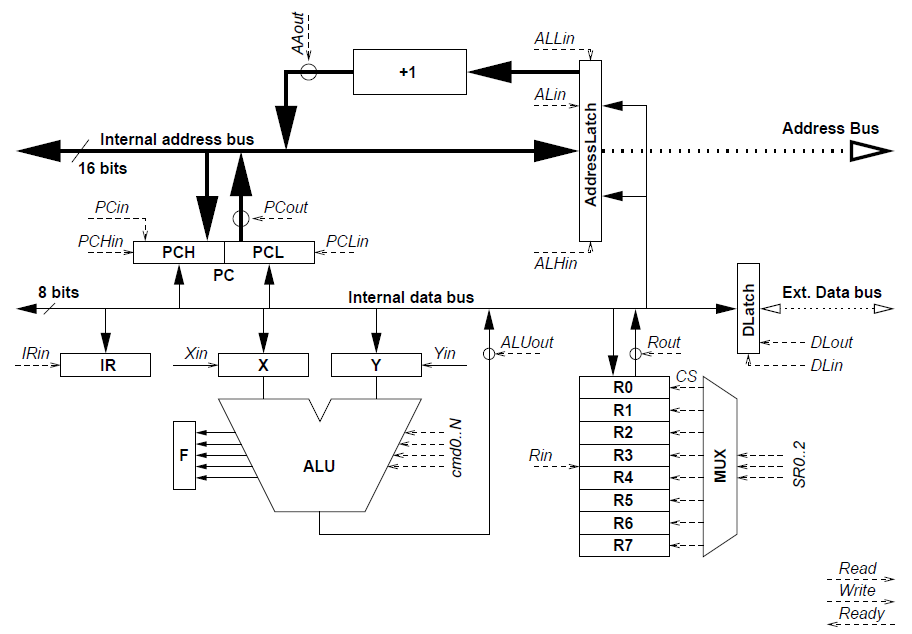

#### Author
Proy Cyril
Boudier Stéphane

# Simulateur d'une micro-architecture
## Architecture

L'objectif de ce programme est de simuler la micro-architecture suivante : 


Cette micro-architecture est composée : 
- **D'un bloc registres 8 bits** : nommés de $R0$ à $R7$, il s'agit de registres généraux 8 bits. Pour manipuler ce bloc, nous disposons d'une commande de sélection $SR$, implémentée par `void SR(int i)` dans `function.c` permettant de sélectionner l'un des huit registres. Le signal $Rin$, implémentée par `void Rin()` dans `function.c`, provoque le chargement dans le registre sélectionné de l'information disponible sur le bus. Le signal $Rout$, implémentée par `void Rout()` dans `function.c`, provoque la mise sur le bus de l'information contenue dans le registre sélectionné.
- **D'un bloc ALU** : constitué d'une unité arithmétique et logique possédant un certain nombre de commandes dont la taille est à déterminer. Un certain nombre de Flags sont stockés dans un registre de flags. Les entrées de l'ALU sont les sorties de deux registres 8 bits $X$ et $Y$. C'est registres peuvent charger l'information présente sur le bus par les signaux $Xin$ et $Yin$, respectivement `void Xin()` et `void Yin()` dans `function.c`. La sortie de l'ALU est relié au bus de données et est activées ç l'aide du signal $ALUout$, implémentée par `void ALUout()` dans `function.c`.
- **D'un bloc de gestion des adresses** : comporenant un bus interne d'adresse 16 bits, un registre $AddressLatch$ 16 bits connecté au bus d'adresse externe, un registre $PC$ (Programm Counter) 16 bits et un incrémenteur.
Les signaux associé au registre $AddressLatch$ sont au nombre de trois : $ALin$, implémenté par `void ALin()`, qui permet de charger dans le registre l'information sur 16 bits présente sur le bus d'adresse interne. $ALLin$, implémenté par `void ALLin()`, qui permet de charger dans la partie basse du registre l'information sur 8 bits présente sur le bus de données interne et $ALHin$, implémenté par `void ALHin()`, qui permet de charger dans la partie haute du registre l'information sur 8 bits présente sur le bus de données interne.
Les signaux associés au registre $PC$ sont au nombre de quatre et sont similaires à ceux pour $AddressLatch$ : $PCin$, implémenté par `void PCin()` qui permet de charger dans le registre l'information sur 16 bits présente sur le bus d'adresse interne. $PCLin$, implémenté par `void PCLin()` qui permet de charger dans la partie basse du registre l'information sur 8 bits présente sur le bus de données interne. $PCHin$, implémenté par `void PCHin()` qui permet de charger dans la partie haute du registre l'information sur 8 bits présente sur le bus de données interne et enfin le signal $PCout$, implémenté par `void PCout()` qui met sur le bus d'adresse interne l'information contenue dans $PC$.
L'incrémenteur prend en entrée le contenu du registre $AddressLatch$ et présente en sortie l'adresse suivante (incrémentation de 1). La sortie de l'incrémenteur est mise sur le bus d'adresse interne par le biais du signal $AAout$, implémenté par `void AAout()`.
- **D'un bloc de contrôle** : constitué d'un registre d'instruction $IR$ codée sur 8 bits et d'une unité de contrôle. L'unité de contrôle est chargée de générer les signaux nécessaire au fonctionnement du microprocesseur en exécutant le cycle :
    1. Lire l'instruction
    2. décoder l'instruction
    3. exécuter l'instruction
    4. préparer l'instruction suivante.
- **D'un bloc gestion de la mémoire** : il comprend un registre de données $DLatch$ (pour Data Latch) codée sur 8 bits qui copie la valeur du bus de données interne sur le signal $DLin$, implémenté par `void DLin()`. Sur un signal $Read$, implémenté par `void Read()`, la mémoire met dans le registre $DLatch$ la valeur de la case mémoire d'adresse $AddressLatch$. Sur un signal $Write$, implémenté par `void Write()`, la mémoire copie dans la case mémoire d'adresse $AddressLatch$ l'information qui est dans $DLatch$. Lorsque la mémoire a terminé l'opération demandée ($Read$ ou $Write$), elle positionne en retour le signal $Ready$.

## Jeu d'instruction
On souhaite que notre micro processeur dispose des instruction suivantes : 
- **JMP HHLL** : Effectue un branchement à l'adresse codée sur 16 bits
- **JZ HHLL** : Effectue un saut à l'adresse 16 bit si l'opération précédente à donné un résultat nul
- **JC HHLL** : Effectue un saut à l'adresse 16 bit si l'opération précédente à engendré une retenue
- **JMP** : Effectue un branchement à l'adresse RX0 (R0 + R1)
- **ST Rn** : Stocke la valeur du reg R0 sur le l'adresse inscrit dans le reg RXn
- **LD Rn** : Charge dans le reg R0 la valeur stockée en mémoire à l'adresse inscrit dans le reg RXn
- **ST Rn, HHLL** : Stocke la valeur du reg Rn en mémoire à l'adresse sur 16 bits
- **LD Rn, HHLL** : Charge dans le reg Rn la valeur stockée en mémoire à l'adresse sur 16 bits
- **MV RN, arg** : Charge dans le reg Rn la valeur de l'argument codée sur 8 bits (soir une valeur immédiate, soir un reg)
- **DEC Rn** : Soustrait 1 à la valeur de Rn et stocke le résultat dans Rn
- **INC Rn** : Ajoute 1 à la valeur de Rn et stocke la résultat dans Rn
- **NOT Rn** : Inverse bit à bit le reg Rn et stocke le résultat
- **ADD Rn, Rm** : Additionne la valeur du reg Rn (premier opérande) avec la valeur du reg Rm (second opérande) et stocke le résultat dans Rn
- **SUB Rn, Rm** : Soustrait la valeur du reg Rm (deuxième opérande) à la valeur du reg Rn (premièer opérande) et stocke le résultat dans Rn
- **AND Rn, Rm** : Fait la conjonction bit à bit des deux regs et range le résultat dans le premier op (Rn codée sur 2 bits)
- **SWP Rn, Rm** : Echange la valeur du reg Rn (premier opérande) au reg Rm (deuxième opérande)

## Entrées / sorties du simulateur
### Entrées
Le simulateur prendra en entrée un programme hexa comme suit : 
```
0200: 51 06
0202: 52 06
0204: 50 06
0206: 58
0207: 8A
0208: 58
0209: 71 02 0F
020C: 70 02 07
020F: 42 03 01
0212: EA
0213: CA
0214: 00
```

Sur chaque ligne du programme figure l'adresse mémoire du début de l'instruction suivie de l'instruction proprement dite.
### Sorties
Le simulateur produira, en plus de l'exécution du programme, le fichier texte comportant le code assembleur équivalent au programme d'entrée.

## Exécution du programme
L'archive contient un Makefile avec les commande suivante : 
- **make** : compile tous les fichier nécessaire et crée le fichier exécutable `simulateur`
- **make clean** : supprime tous les fichier exécutables, objet et le fichier de sortie

L'archive contient aussi deux programme, programme.txt et programme2.txt.
Le simulateur est donc exécutable grace a cette commande : `./simulateur <fichier_instructions>`